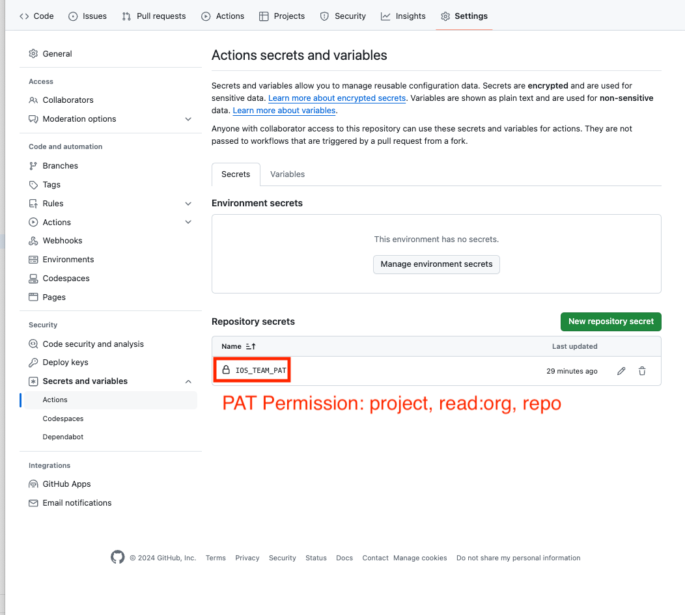

# Swift OpenAPI Generator Sample

### 概要

以下の 2 点を検証したリポジトリになります。

- Apple 公式の [swift-openapi-generator](https://github.com/apple/swift-openapi-generator) を用いて、`openapi.yaml` から API Request に必要なコードを生成して、それを実行する iOS プロジェクトの検証
- GitHub Actions を用いて、外部リポジトリ（サーバーサイドリポジトリ）の `openapi.yaml` の更新をトリガーに、iOS リポジトリに対して [swift-openapi-generator](https://github.com/apple/swift-openapi-generator) で生成されたコードの変更の PR を作成する Workflow の検証

### Workflows

以下の 2つの workflow から構成されます。

- [trigger_update_open_api_spec.yaml](https://github.com/suguruTakahashi-1234/swift-openapi-gen-sample/actions/workflows/trigger_update_open_api_spec.yaml)
  - 外部リポジトリ（サーバーサイドリポジトリ）の `openapi.yaml` の更新をトリガーを検知する workflow
    - 今回はサンプルとして、[deploy-swagger-pages](https://github.com/suguruTakahashi-1234/deploy-swagger-pages) という  `openapi.yaml` を元に GitHub Pages を作成するリポジトリを指定
    - [repository-dispatch](https://github.com/peter-evans/repository-dispatch) という別リポジトリの GitHub Actions のトリガーを kick する Actions Marketplace を使用
- [code_gen_from_openapi_spec.yaml](https://github.com/suguruTakahashi-1234/swift-openapi-gen-sample/actions/workflows/code_gen_from_openapi_spec.yaml)
  - [repository-dispatch](https://github.com/peter-evans/repository-dispatch) のトリガーを検知して、外部リポジトリから iOS リポジトリ（このリポジトリ）の `openapi.yaml` の差分と [swift-openapi-generator](https://github.com/apple/swift-openapi-generator) によって生成されるコードの差分の PR を作成する

### Settings

#### Actions

※ iOS Repo Only

#### Secrets And Variables

※ Server Side Repo Only

### Lisks

- swift-openapi-generator
  - https://github.com/apple/swift-openapi-generator
- Meet Swift OpenAPI Generator
  - https://developer.apple.com/videos/play/wwdc2023/10171/
- Swift OpenAPI Generator に 入門する
  - https://speakerdeck.com/kamimi/the-guide-of-swift-openapi-generator-for-beginners
- SPMとSwift OpenAPIGenerator
  - https://www.docswell.com/s/fromkk/56YPEL-openapi-generator
- Swift OpenAPI Generator で Swift でのスキーマ駆動開発がもっと便利になる - はじめに -
  - https://zenn.dev/kamimi01/articles/7c6f79e42c3750
- Overview: Swift OpenAPI Generator
  - https://zenn.dev/ojun_9/articles/67c5d3822e5a91
- GitHub Actions
  - https://github.com/peter-evans/repository-dispatch
  - https://github.com/peter-evans/create-pull-request

